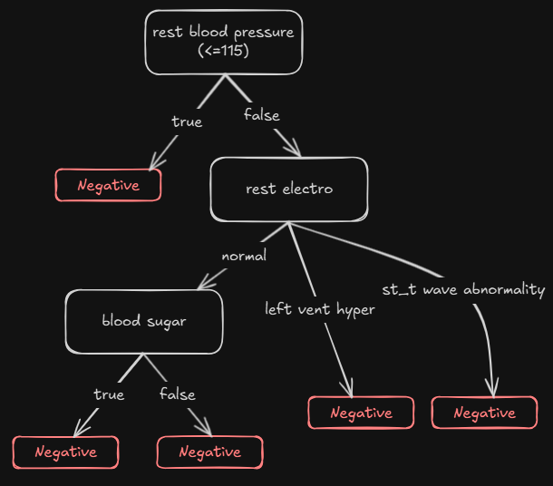

# Heart Disease Detector

The project implements _Naive Bayes_ and _ID3 Decision Tree_ algorithms, providing both probabilistic outputs and transparent decisions, while handling discrete, continuous, and missing data.

The algorithms are then used to build heart disease detection models.

The implementation is tested to cover core functionality, edge cases, and correctness against known examples

**Dependencies**: None.

## Features

### Naive Bayes Classifier

- Linear complexity (in the size of the training data)
- Discrete attribute handling with Laplace smoothing
- Continuous attribute modeling via Gaussian distributions
- Automatic missing-value handling:
  - Training: ignores missing entries when computing statistics
  - Prediction: treats missing features as neutral (probability = 1)
- Returns predicted class and normalized class probabilities

## ID3 Decision Tree

- Tree built using _Gain Ratio_ to avoid bias toward high‑cardinality attributes
- Continuous attributes Converted into boolean splits by selecting optimal thresholds (at each split)
- Redundant features repeatedly dropped (at each split)
- **Built‑in pruning**: collapses homogeneous subtrees into single leaves
- Detailed introspection:
  - Exposes full tree structure
  - Traces the exact decision path for each prediction
- Robust missing‑value strategy:
  - Training: replaces missing values via randomized frequency‑based sampling (at each split)
  - Prediction: uses the most common value **per node**

## Heart Disease Models

_full code at [data-mining/example.js](./data-mining/example.js)_

```js
const dataPath = path.join(__dirname, 'heart_disease_male.csv')

const continuosAttributes = ['age', 'rest_blood_pressure', 'max_heart_rate']

const { data: originalData, attributes } = prepareData({
  data: readFile(dataPath),
  continuosAttributes,
  decisionAttribute: 'disease',
  missingDataValues: ['?', ''],
  positiveDecisionValue: 'positive',
  renameDecisionTo: 'decision',
})

const shuffledData = randomShuffle(originalData, 1)

const [trainData, testData] = splitData(shuffledData, 0.3)
trainData.unshift(attributes.slice())
testData.unshift(attributes.slice())

const id3Classifier = createId3Classifier(trainData, continuosAttributes)
const bayesClassifier = createBayesClassifier(trainData, continuosAttributes)

console.log({
  originalDataLength: originalData.length,
  trainDataLength: trainData.length - 1,
  testDataLength: testData.length - 1,
  bayesTrainAccuracy: calcAccuracy(getDataAsObjects(trainData), bayesClassifier),
  bayesTestAccuracy: calcAccuracy(getDataAsObjects(testData), bayesClassifier),
  id3TrainAccuracy: calcAccuracy(getDataAsObjects(trainData), id3Classifier),
  id3TestAccuracy: calcAccuracy(getDataAsObjects(testData), id3Classifier),
})

/*
{
  originalDataLength: 209,
  trainDataLength: 147,
  testDataLength: 62,
  bayesTrainAccuracy: 0.8027210884353742,
  bayesTestAccuracy: 0.7903225806451613, 
  id3TrainAccuracy: 0.8367346938775511,  
  id3TestAccuracy: 0.8064516129032258    
}
*/

const objectToBeClassified = {
  age: 43,
  rest_blood_pressure: 140,
  max_heart_rate: 135,
  blood_sugar: 'FALSE',
  rest_electro: 'normal',
  chest_pain_type: 'asympt',
  exercice_angina: 'yes',
}

console.log('using id3:', id3Classifier.classify(objectToBeClassified), '\n')
console.log('using bayes:', bayesClassifier.classify(objectToBeClassified), '\n')

/*
using id3: {
  decision: 1,
  path: [ 'exercice_angina', 'max_heart_rate', 'chest_pain_type' ]
}

using bayes: { '0': 0.12990437484892872, '1': 0.8700956251510712, decision: 1 }
*/
```

with 70/30 train/test split, the accuracies:

|             |     | training | testing |
| ----------- | --- | -------- | ------- |
| naive bayes |     | 80.3%    | 79%     |
| id3         |     | 83.7%    | 80.6%   |

(**ID3 tree size:** 11 internal nodes, 16 leaves)

## Algorithms Details

### Naive Bayes

- **Laplace Smoothing** prevents zero probabilities (`P(x_i | y_i) = (nc + 1) / (n + u)`)
  - nc: number of samples where feature=x_i, and decision=y
  - n: total samples with decision=yi
  - u: number of unique values for the feature
- **Continuous Attributes** modeled by fitting a Gaussian distribution (estimating mean and variance).

## ID3 Decision Tree

- **Threshold Selection** for continuous features:
  - Sort unique values, compute midpoints as candidate thresholds (**at each node**).
  - Choose threshold maximizing Gain Ratio.
- **Missing Values**:
  - **Training**: fill each missing entry by randomly sampling from observed values with probabilities proportional to their frequencies.
  - **Prediction**: use the most frequent value at the current node.
- **Tree Pruning**:
  - During training, collapse any subtree whose all leaves predict the same class into a single leaf. (tree pruning)
- **Explainability**: tree graph exposed, allowing path tracing for each prediction
  - `<classifier>.getRootNode()`
  - `<node>.getAdjacentNodes()`
  - `<node>.getNodeInfo()`
